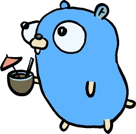

<!-- Background Wrapper with Tech Wallpaper -->

<!-- Header Wave -->
 

<!-- Typing Intro -->  

  

----

  

<!--## 🚀 GitHub Insights  -->

  <!--  -->
  

## Tech Stack  

  

---

<!--## 🧠 Profile Highlights -->  

  
  

---

---

##  About Me  
Full-Stack Developer with a strong focus on backend development using Golang.
I enjoy building scalable, maintainable systems with clean architecture and well-designed APIs.

I have hands-on experience with React on the frontend and a solid foundation in modern JavaScript, Redux, and Tailwind CSS.
Currently, I’m deeply focused on backend engineering, working with Golang, Gin, GORM, and PostgreSQL to build reliable, production-ready applications.

Always learning, experimenting, and solving problems through real-world projects.

---

##  Connect ME ON 

  
  
  
  

---

<h3 align="center">✨ Let's Collaborate and Build Something Impactful ✨</h3>

<!-- Footer Graph Animation (Snake Style) -->
<!-- 

  

 -->

<!-- Footer Wave -->

