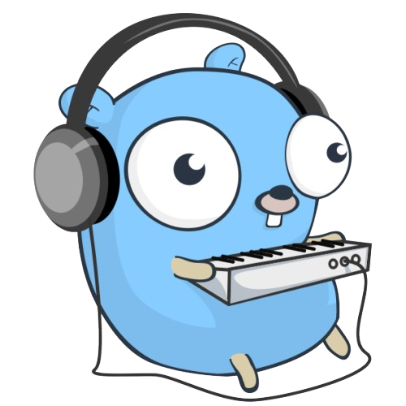
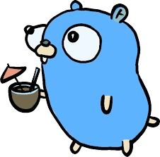

<!-- Background Wrapper with Tech Wallpaper -->

  

<!-- Header Wave -->
 

<!-- Typing Intro -->  

  

---

  

<!--## 🚀 GitHub Insights  -->

  <!--  -->
  <!--  -->

<h3>💻 Tech Stack</h3>

<!-- <table width="100%">
  <tr>
    <th width="25%" align="left">Category</th>
    <th width="75%" align="left">Technologies</th>
  </tr>
  <tr>
    <td><b>🎨 Frontend</b></td>
    <td></td>
  </tr>
  <tr>
    <td><b>⚙️ Backend & Database</b></td>
    <td></td>
  </tr>
  <tr>
    <td><b>🛠️ Tools & DevOps</b></td>
    <td></td>
  </tr>
  <tr>
    <td><b>🖥️ Operating Systems</b></td>
    <td></td>
  </tr>
</table> -->

<table align="center">

  <tr>
    <td align="center"> <b>Go</b></td>
    <td align="center"> <b>Gin</b></td>
    <td align="center"> <b>PostgreSQL</b></td>
    <td align="center"> <b>REST API</b></td>
    <td align="center"> <b>GORM</b></td>
    <td align="center">  <b>JWT</b</td>
    <td align="center">  <b>Fiber</b></td>  
  </tr>
  <tr>
     <td align="center"> <b>Redis</b></td> 
    <td align="center">  <b>Docker</b</td>
    <td align="center"> <b>Postman</b></td>
    <td align="center">  <b>Notion</b></td>
    <td align="center">  <b>Kafka</b></td>
    
  </tr>
  
  <tr>
    <td align="center"> <b>HTML5</b></td>
    <td align="center"> <b>CSS3</b></td>
    <td align="center"> <b>JavaScript</b></td>
    <td align="center"> <b>React</b></td>
    <td align="center"> <b>Redux</b></td>
    <td align="center"> <b>TailwindCSS</b></td>
 </tr>
 
</table>

***
<!--## 🧠 Profile Highlights -->  

  
  

---

---

### 👋 About Me

* 💻 Fullstack developer with a background bridging **React** and **Go**.
* ⚙️ Currently hyper-focused on the "deep backend" phase: mastering **Golang** and **Microservices architecture**.
* 🧠 Passionate about writing highly efficient, optimized code by leveraging core data structures (trees, graphs, queues) and advanced sorting algorithms.
* 🚀 Driven by building robust, scalable systems and solving complex backend challenges.

---

##  Connect ME ON 

  
  
  
  

---

<h3 align="center">✨ Let's Collaborate and Build Something Impactful ✨</h3>

<!-- Footer Graph Animation (Snake Style) -->
<!-- 

  

 -->

<!-- Footer Wave -->

<!--  -->

